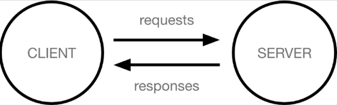

# 01_Start_Django

### 0. Index

1. [Intro](#-Intro)
2. [Design_Pattern](#-Design_Pattern)

---

### 1. Intro

- framework
  
  - 서비스 개발에 필요한 기능들을 미리 구현해서 모아 놓은 것.
  
  - 소프트웨어 생산성과 품질을 높임.

- www(World WIde Web)
  
  - 전 세계에 퍼져 있는 거미줄 같은 연결망

- Client - Server
  
  - 오늘날 대부분 웹서비스는 클라이언트-서버 구조 기반
    
    
  
  - Client - 서비스를 요청하는 주체. (웹사용자의 인터넷 연결장치, 웹 브라우저)
    Server - 요청에 대해 서비스를 응답하는 주체. (웹페이지, 사이트, 앱 등을 저정하는 컴퓨터)
  
  - 어떠한 자원(resource)를 요청(request)하는 쪽을 Client, 자원을 제공하는 쪽을 서버(Server)라고 함.

- Web browser
  
  - 웹페이지는 HTML문서 파일 하나. 즉, 웹페이지 코드를 받으면 우리가 보는 화면처럼 바꿔주는 것이 바로 웹 브라우저.
  
  - Static web page 
    
    - 모든 사용자에게 동일한 페이지 전달
  
  - Dynamic web page 
    
    - 사용자의 요청에 따라 웹페이지에 추가적인 수정 후 클라이언트에게 전달되는 웹페이지
    
    - 웹페이지의 내용을 바꿔주는 주체 == server
      서버에서 동작하고 있는 프로그램이 웹페이지를 변경. 이렇게 사용자의 요청을 받아 적절한 응답을 만들어주는 프로그램을 쉽게 만들도록 도와주는 프레임워크가 Django.

---

### 2. Design_Pattern

- 각기 다른 기능의 다양한 응용 소프트웨어 개발시 공통적인 설계 문제, 해결책 사이에도 공통점이 있음, 이러한 유사점을 패턴
  
  자주 사용되는 소프트웨어의 구조를 건축 공법처럼 일반적인 구조화를 해둔것. (Client - Server 구조도 소프트웨어 디자인 패턴 중 하나.)

<br>

- MTV 패턴
  
  - Model - Template - View
  
  - Model
    
    - 데이터와 관련된 로직 관리. 응용프로그램의 데이터 구조 정의, 데이터베이스 기록을 관리.
  
  - Template
    
    - 화면 상 사용자 인터페이스 구조와 레이아웃을 정의.
  
  - View
    
    - Model & Template과 관련된 로직 처리 후 응답 반환. (client 요청에 대한 처리를 분기하는 역할.)
    
    - ex) 데이터 필요시 model에 접근해 데이터를 가져오고, 가져온 데이터를 template로 보내 화면 구성 후 응답으로 만들어 클랑이언트에게 반환.
      
      
  
  - MVC 디자인 패턴을 기반으로 조금 변형된 패턴. (Model - View - Controller)
    
    

---

### 3. Django_start

- 포로젝트 생성
  
  ```git
  # django 3.2버전 설치
  $ pip install django==3.2.13
  # 패키지 목록생성
  $ pip freeze > requirements.txt
  # 프로젝트 생성(마지막 dot 중요, 붙이지 않을 경우 프로젝트 디렉토리 새로 생성)
  $ django-admin startproject <프로젝트이름> .
  # 서버실행
  $ python manage.py runserver
  ```

- 프로젝트 구조
  
  
  
  - __init__.py : python에게 이 디렉토리를 하나의 python 패키지로 다루도록 지시. (추가코드 x)
  
  - asgi.py : Asychronous Server Gateway Interface, Django 애플리케이션 비동기식 웹서와 연결 및 소통을 도움. (추후 배포시 사용)
  
  - settings.py : Django 프로젝트 설정을 관리.
  
  - urls.py : 사이트 url과 적절한 views의 연결 지정.
  
  - wsgi.py : Web Server Gateway Interface, Django애플리케이션이 웹서버와 연결 및 소통 도움. (추후 배포시 사용)
  
  - manage.py : Django프로젝트와 다양한 상호작용하는 커맨드라인 유틸리티
    
    ```git
    # manage.py Usage
    $ python manage.py <command> [opitons]
    ```

<br>

- 애플리케이션(앱) 생성
  
  ```git
  # appname은 복수형작성 권장.
  $ python manage.py startapp <appname>
  ```

- 애플리케이션 구조
  
  
  
  - admin.py :  관리자용 페이지 설정
  - apps.py : 앱 정보가 작성된 곳, 별도의 추가 코드 x
  - models.py :  애플리케이션에서 사용하는 Model을 정의하는 곳. (MTV 의  M)
  - tests.py : 프로젝트의 데스트 코드 작성
  - views.py : view함수 정의. (MTV의 V)

- 애플리케이션 등록
  
  ```python
  # settings.py
  INSTALLED_APPS = [
      'articles',
      'django.contrib.admin',
      'django.contrib.auth', 
      ....
  ]
  ```
  
  - 프로젝트에서 앱사용을 위해선 반드시 리스트에 추가해야 한다.(반드시 생성 후 등록)

<br>

- Project  & Application
  
  - Project : 앱의 집합.
  
  - Application : 실제 요청 처리, 페이지를 보여주는 등 역할 담당 / 일반적으로 하나의 역할 및 기능 단위로 작성을 권장.

- 데이터의 흐름 순서 (코드 작성 순서)
  
  

---

### 4. Django_Template

- "데이터 표현을 제어하는 도구이자 표현에 관련된 로직" (HTML 정적, 동적 컨테츠 삽입)

- DTL (Django Template Language)
  
  - 프로그래밍적 로직 x 프레젠테이션을 포현하기 위한 것임을 명심.
  
  - | DTL Syntax  |                                                                                                                                      |
    | ----------- | ------------------------------------------------------------------------------------------------------------------------------------ |
    | 1. Variable | {{ variable }}  dot(.)을 사용해 변수 속성 접근 가능 <br/>render() 세번째 인자로 {'key':value}와 같이 딕셔너리 형태로 넘겨주며, key에 해당하는 문자열이 template에서 사용 가능한 변수명. |
    | 2. Fiters   | {{ variable\|filter }} 표시할 변수를 수정할 때 사용.                                                                                             |
    | 3. Tags     |   제어흐름을 만드는 등 변수보다 복잡한 일들을 수행                                                                                               |
    | 4. Comments |  .....   여러줄 주석                                                                                         |

<br>

- Template inheritance (템플릿 상속)
  
  1. 프로젝트 최상단 templates / base.html 부모 템플릿 생성 
     
     하위 탬플릿 재지정을 할 수 있는 블록을 정의
     
     ```html
      
     ```
     
     ```html
     <!-- templates/base.html -->
     <!DOCTYPE html>
     <html lang="en">
     <head>
       ...
       <link href="https://cdn.jsdelivr.net/npm/bootstrap@5.2.0/dist/css/bootstrap.min.css" rel="stylesheet" integrity="sha384-gH2yIJqKdNHPEq0n4Mqa/HGKIhSkIHeL5AyhkYV8i59U5AR6csBvApHHNl/vI1Bx" crossorigin="anonymous">  <title>Document</title>
     </head>
     <body>
       <div class="container">
         
     
         
       </div>
       <script src="https://cdn.jsdelivr.net/npm/bootstrap@5.2.0/dist/js/bootstrap.bundle.min.js" integrity="sha384-A3rJD856KowSb7dwlZdYEkO39Gagi7vIsF0jrRAoQmDKKtQBHUuLZ9AsSv4jD4Xa" crossorigin="anonymous"></script>
     </body>
     </html>
     ```
  
  2. 자식템플릿이 부모템플릿을 확장한다는 것을 알림.
     
     ```html
     <!-- articles/templates/articles/base.html namespace는 추후 다룰 예-->
     
     
     
     
     
     ```
  
  3. 앱 안의 template디렉토리가 아닌 프로젝트 최상단의 templates 디렉토리 경로 추가하기.
