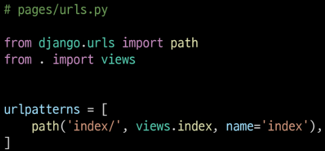
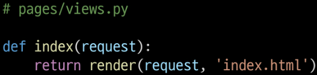
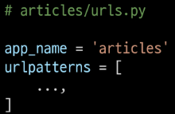
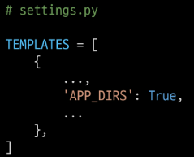

# 02_Django_Model

### 0. Index

1. [Namespace]

2. [Django Model]

3. [Queryset API]

4. [CRUD with view fucntions]

5. [Admin site]

---

### 1. Namespace

- Namespace의 필요성 : 두번째 app pages의 index 페이지를 작성하게되면 생긱는 문제
  
  
  
  

- 2가지 문제 발생
  
  1. articles app index 페이지에서 두번째 앱 index로 이동하는 하이퍼링크 클릭 시 현재 페이지로 다시이동 -> URL namespace
  
  2. pages app의 index url로 직접 이동해도 articles app의  index 페이지가 출력됨. -> Template namespace

- URL namespace
  
  - URL namespace를 사용하면 서로 다른 앱에서 동인할  URL 이름을 사용하는 경우에도 이름이 지정된 URL을 고유하게 사용 가능.
    
    
  
  - URL 참조  " : " 연산자를 사용하여 지정.
  
  - URL tag 변화
    
    

- Template namespace
  
  - Django는 기본적으로 app_name/templates/ 경로에 있는 templates 파일들만 찾을 수 있으며,
    settings.py의 INSTALLED_APPS 작성 app 순서로 template 검색 후 렌더링.
    
    
  
  - 

